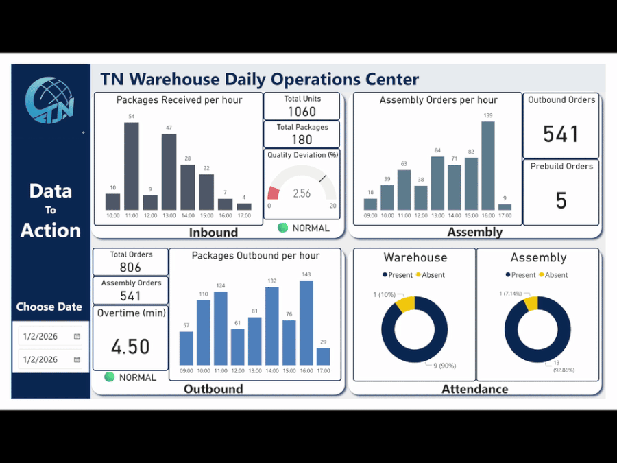
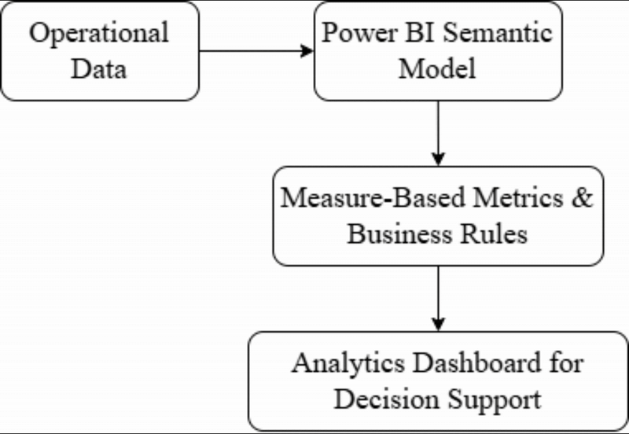

# Warehouse Operations Analytics Dashboard

## 30-Second Quick View

- Built an analytics-driven Power BI dashboard to centralize daily warehouse operations data into a single decision-focused view.
- Applied hourly time-based aggregation to reveal intra-day workload patterns and bottlenecks.
- Implemented rule-driven metrics (overtime, quality deviation) to monitor SLA performance and operational risk.
- Designed a source-agnostic analytical layer, enabling future scaling from Excel snapshots to SQL pipelines.
- Enabled clearer, faster data-driven decision-making for operational and management stakeholders.

## Core Skills Demonstrated:

Data Analytics · Time-Series Aggregation · KPI Design · Operations Intelligence · Decision Support · Power BI

## 1\. Business Context

Warehouse operations generate high-frequency, event-level data across inbound receiving, assembly processing, outbound shipping, and workforce attendance.

While these datasets are operationally critical, they are often siloed, making it difficult for analysts and stakeholders to evaluate operational performance, identify bottlenecks, and assess service-level risk in a timely manner.

This project addresses the need for a centralized analytical view that transforms raw operational data into decision-ready insights.

## 2\. Analytical Objective

The objective was to design and enhance an analytics-driven dashboard that:
- Consolidates multi-source operational data into a unified analytical layer
- Applies time-based aggregation to surface intra-day workload patterns
- Embeds rule-driven metrics to monitor SLA performance and operational risk
- Supports management decision-making through clear, interpretable indicators

The focus is on analysis and insight generation, rather than static reporting.

## 3\. Analytical Design \& Methodology

### Time-Based Aggregation

Operational events are aggregated at an hourly level, enabling detection of:
- Throughput imbalance
- Capacity constraints
- Late-day workload accumulation

This temporal granularity provides significantly more insight than daily totals alone.

### Rule-Driven Metrics

Business rules are implemented at the semantic layer to ensure consistency and scalability:
- Overtime (minutes):
Computed as the difference between the latest outbound completion time and predefined cutoff thresholds (weekday vs. Saturday logic).
- Quality Deviation (%):
Quantifies deviation from expected operational quality benchmarks and triggers alerts when thresholds are exceeded.

These metrics convert descriptive data into diagnostic and risk-aware indicators.

### Signal Prioritization

The dashboard explicitly separates:
- Decision signals (KPIs, alerts, SLA indicators)
- Contextual trends (hourly throughput distributions)

This design minimizes cognitive load and improves interpretability for non-technical stakeholders.

## 4\. Key Analytical Metrics

- Inbound Throughput: Packages received per hour
- Assembly Throughput: Assembly orders processed per hour
- Outbound Throughput: Packages shipped per hour
- SLA Indicators: Overtime minutes, quality deviation alerts
- Workforce Context: Attendance status (present vs. absent)

Together, these metrics provide a holistic view of operational health.

## 5\. Scenario Analysis

The dashboard supports consistent interpretation across operational conditions:
- Normal Operations: Balanced throughput and SLA compliance
- Alert Scenarios: SLA breach or quality deviation triggers visual alerts

The same analytical framework remains valid across scenarios, reinforcing trust in the metrics.

## 6\. Data Model \& Architecture

### Data Sources:

Daily operational snapshots (Excel-based, SQL-ready)

### Analytical Flow:

The analytical logic is decoupled from the data source, allowing seamless migration to SQL pipelines as data volume grows.

## 7\. Analytical Impact

- Centralized fragmented operational datasets into a single analytical interface
- Improved visibility into hourly operational patterns and SLA risk
- Enabled faster, data-driven management decisions
- Established a scalable foundation for future predictive and diagnostic analysis

## 8\. Future Analytical Extensions

- SQL-based ingestion pipelines and incremental refresh
- Drill-through analysis at order or SKU level
- Predictive indicators for early risk detection
- Integration with downstream forecasting models

## 9\. Key Takeaways

This project demonstrates applied data analytics skills in:
- Time-series aggregation
- Business rule modeling
- Operational risk monitoring
- Analytics-driven decision support
- Scalable dashboard architecture

